# <u>P2. Conexiones de redes y gestión de recursos en sistemas Windows</u>

## 1. Identificación de interfaces de red
### Comando: 
- ipconfig /all

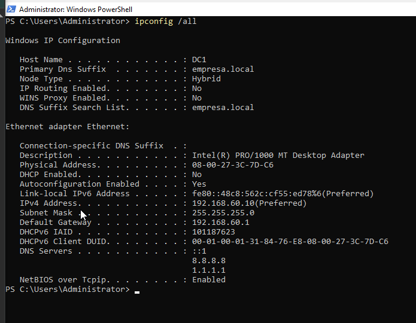

### Respuestas: 
- ¿Qué interfaces de red aparecen?  
--> Aparece una sola interfaz: Ethernet adaptar Ethernet  
--> Es una tarjeta de red física (Intel PRO/1000), usada para conectar el equipo a la red local.

- ¿Cuál es la interfaz activa?  
--> La interfaz activa es: Ethernet  
--> ¿Por qué?    
Porque :
  Tiene dirección IP: 192.168.60.10  
  No está desconectada  
 Tiene puerta de enlace: 192.168.60.1

- ¿Qué dirección MAC tiene la interfaz?  
--> 08-00-27-3C-7D-C6

### Explicacion:
- El comando ipconfig /all se utiliza para ver la configuración completa de red del equipo. Permite identificar las interfaces de red, la dirección IP, la puerta de enlace, los servidores DNS y la dirección MAC.  
En este caso, se observa un adaptador Ethernet activo con la IP 192.168.60.10, correctamente configurado dentro de la red.

### Documentación consultada:
[Miscrosoft](https://learn.microsoft.com/en-us/windows-server/administration/windows-commands/ipconfig)

## 2. Identificación de adaptadores de red
### Comando:

- Get-NetAdapter

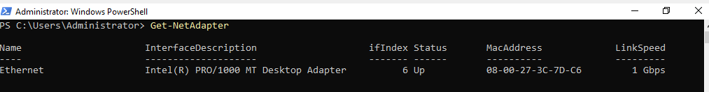

### Respuesta:
- ¿Qué adaptadores aparecen en el sistema?  
--> El comando muestra los adaptadores de red disponibles en el sistema. En mi caso aparece el adaptador Ethernet, que corresponde a la tarjeta de red física de mi equipo.

- ¿Cuál es el nombre exacto de la interfaz utilizada?  
--> Nombre exacto: Ethernet

### Explicacion:
- El comando Get-NetAdapter permite listar los adaptadores de red del sistema junto con su estado. En la salida se observa el adaptador "Ethernet" con estado "Up", lo que indica que está activo. Este es el adaptador que se está utilizando para la conexión a la red.

- Explicacion de la salida:
-> Name: Ethernet → nombre del adaptador  
-> Status: Up → está activo  
-> LinkSpeed: velocidad de conexión  
-> MacAddress: dirección física

### Documentacion consultada:
[Microsoft](https://learn.microsoft.com/en-us/powershell/module/netadapter/get-netadapter)

## 3. Identificación de la configuración IP
### Comando:

- ipconfig

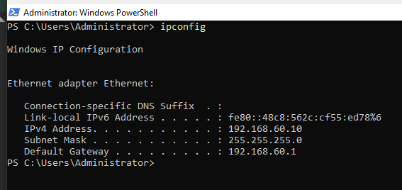

### Respuesta:
- ¿Qué dirección IP tiene actualmente el sistema? 
--> 192.168.60.10

- ¿Qué máscara de red utiliza? 
--> 255.255.255.0  
--> Esto indica que pertenece a una red tipo /24

- ¿Existe una puerta de enlace configurada? 
--> Sí: 192.168.60.1

### Explicacion:
- Se ejecutó el comando ipconfig para obtener la configuración IP del sistema.
El equipo tiene asignada la dirección IP 192.168.60.10 con una máscara de red 255.255.255.0, lo que indica que pertenece a la red 192.168.60.0/24.
Además, se observa una puerta de enlace configurada (192.168.60.1), que permite la comunicación con otras redes.

- Explicacion de la salida:
-> IPv4 Address: dirección del equipo en la red  
-> Subnet Mask: define el tamaño de la red  
-> Default Gateway: salida hacia otras redes

### Documentacion consultada:
[Microsoft](https://learn.microsoft.com/en-us/windows-server/administration/windows-commands/ipconfig)

## 4.Análisis de la tabla de rutas
### Comando:
- route print
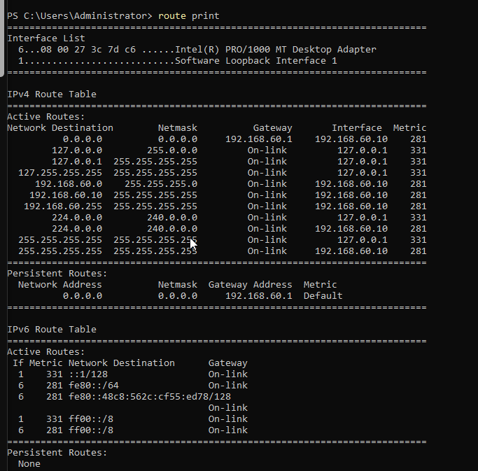

### Respuesta:
- ¿Qué red local aparece configurada?  
--> 192.168.60.0 

- ¿Qué interfaz se utiliza para acceder a la red?  
--> La interfaz con IP: 192.168.60.10

- ¿Qué significa cada columna de la tabla?  
--> En la tabla verás columnas como estas:  
-Network Destination: 192.168.60.0  
-Netmask: 255.255.255.0  
-Gateway: 0.0.0.0 → salida por defecto (Internet), 192.168.60.1 → router  
-Interface: IP del equipo que envía los datos 192.168.60.10
-Metric: Cuanto más bajo, mejor (más preferida)

### Explicacion:
- El comando route print muestra la tabla de rutas del sistema, que indica cómo se envían los paquetes de red.
Se observa que la red local configurada es 192.168.60.0/24.
La interfaz utilizada es la que tiene la dirección IP 192.168.60.10.
La tabla incluye columnas como destino de red, máscara, puerta de enlace, interfaz y métrica, que permiten al sistema decidir la mejor ruta para enviar los datos.

### Documentacion consultada:
[Microsoft](https://learn.microsoft.com/en-us/windows-server/administration/windows-commands/route_ws2008)

## 5.Configuración del nombre del equipo
### 5-1. Consultar el nombre actual
#### Comando:

- hostname

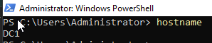  

--> Este comando muestra el nombre actual del equipo de windowsServer 2022.  

- Desde windows 11:

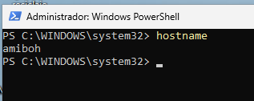

### 5-2.Cambiar el nombre del equipo
#### Comando:
- Rename-Computer -NewName win-srv01 -Restart
- Rename-Computer -NewName win-cli01 -Restart  

--> Cambia el nombre del equipo  
--> Reinicia automáticamente el sistema para aplicar el cambio

### 5-3.Comprobar el cambio
#### Comando:

- hostname  
--> Desde windows Server 2022  
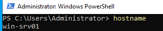  

--> Desde Windows 11:  
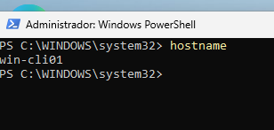

### Explicación del comando
- hostname  
--> Muestra el nombre del equipo en la red.

- Rename-Computer  
--> Permite cambiar el nombre del sistema en Windows.

### Explicacion:
- El comando hostname permite consultar el nombre actual del equipo en la red.
Posteriormente, se utilizó el comando Rename-Computer para cambiar el nombre del sistema, aplicando los nombres win-srv01 para el servidor y win-cli01 para el cliente.
Tras reiniciar el sistema, se verificó el cambio ejecutando nuevamente hostname.
El nombre del equipo es fundamental en una red, ya que permite identificar los dispositivos y acceder a recursos compartidos.

### Documentacion consultada:
[Microsoft](https://learn.microsoft.com/en-us/powershell/module/microsoft.powershell.management/rename-computer)

## 6. Configuración de dirección IP estática
### 6-1.Consultar la interfaz de red
#### Comando:
- Get-NetAdapter 
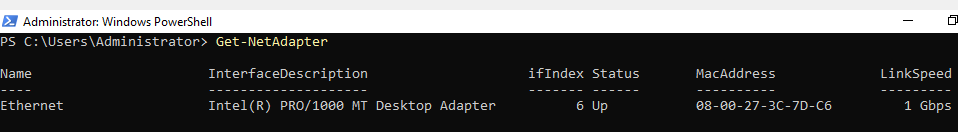  

--> Esto muestra los adaptadores disponibles.  
--> Ethernet  

--> En windows 11:  

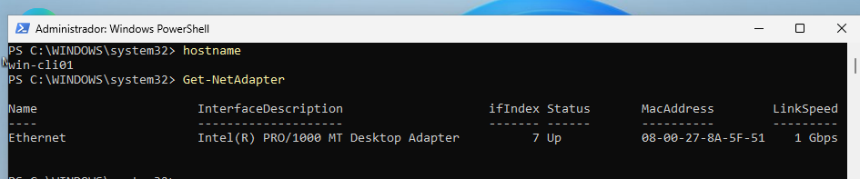

### 6-2.Configurar la IP estática
#### Comando:
- Windows server 2022
- New-NetIPAddress -InterfaceAlias "Ethernet" -IPAddress 192.168.60.10 -PrefixLength 24
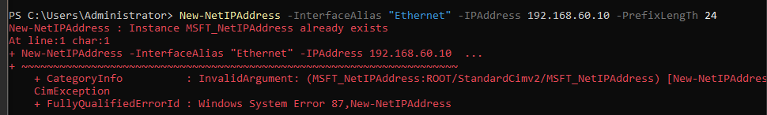  

--> Al ejecutar el comando New-NetIPAddress, el sistema mostró un error indicando que la dirección IP ya existía.
Esto se debe a que la interfaz de red ya tenía configurada la IP 192.168.60.10.
Por tanto, no fue necesario realizar cambios adicionales, ya que la configuración ya cumplía con los requisitos del ejercicio.
Se verificó la configuración mediante el comando ipconfig, confirmando que la dirección IP es correcta.  

- Windows 11:
- New-NetIPAddress -InterfaceAlias "Ethernet" -IPAddress 192.168.60.20 -PrefixLength 24

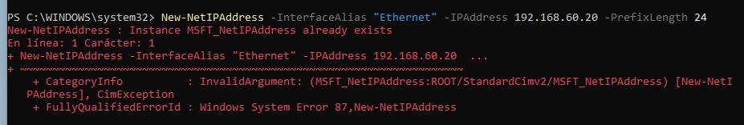

#### Exlicacion de los parámetros:
- -InterfaceAlias "Ethernet"  
--> Indica en qué interfaz se configura la IP  
- IPAddress
--> Dirección IP que asignas al equipo  
- PrefixLength 24
--> Equivale a la máscara 255.255.255.0

### 6-3.Comprobar la configuración
#### Comando:

- ipconfig
--> Windows server 2022  
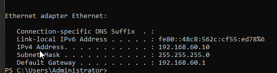  

--> Windows 11 
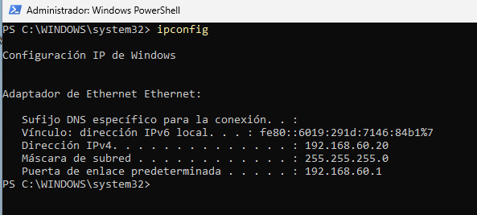

### Explicacion:
- Se utilizó el comando Get-NetAdapter para identificar la interfaz de red activa (Ethernet).
Posteriormente, se configuró una dirección IP estática mediante el comando New-NetIPAddress, indicando la interfaz, la dirección IP y el prefijo de red.
El parámetro -PrefixLength 24 corresponde a una máscara de subred 255.255.255.0.
Finalmente, se verificó la configuración con el comando ipconfig, comprobando que la IP se había aplicado correctamente.

### Documentacion consultada:
[Microsoft](https://learn.microsoft.com/en-us/powershell/module/nettcpip/new-netipaddress)

## 7. Verificación de conectividad entre equipos
### Comando:
- Windows Server 2022:
- ping 192.168.60.10
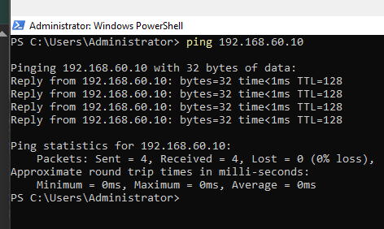

- Windows 11:
- ping 192.168.60.20
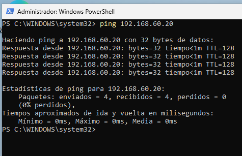

### 1.¿Se reciben respuestas?
- Sí, se reciben respuestas correctamente (si todo está bien configurado)  
-Ejemplo:  
--> Reply from 192.168.60.10: bytes=32 time<1ms TTL=128

### 2. ¿Cuántos paquetes se envían y reciben?
- Al final del comando:
--> Packets: Sent = 4, Received = 4, Lost = 0 (0% loss)  
-Enviados: 4  
-Recibidos: 4  
-Perdidos: 0

### 3.¿Qué información muestra el comando?
- El ping muestra:  

-IP destino → a quién haces ping  
-bytes → tamaño del paquete  
-time → tiempo de respuesta  
-TTL → tiempo de vida del paquete  
-estadísticas finales → paquetes enviados/recibidos

### Explicacion:
- Se utilizó el comando ping para comprobar la conectividad entre los equipos de la red.
Se enviaron 4 paquetes y se recibieron 4 respuestas, sin pérdidas, lo que indica que la comunicación es correcta.
El comando muestra información como el tiempo de respuesta, el tamaño de los paquetes y estadísticas de envío y recepción.

### Documentacion consultada:
[Microsoft](https://learn.microsoft.com/en-us/windows-server/administration/windows-commands/ping)

## 8.Configuración de resolución de nombres local

### 8-1.EN WINDOWS SERVER (win-srv01)
#### 1.Abrir el archivo hosts como administrador:
- notepad C:\Windows\System32\drivers\etc\hosts

#### 2.Añadir estas líneas:
- 192.168.60.10 win-srv01
- 192.168.60.20 win-cli01

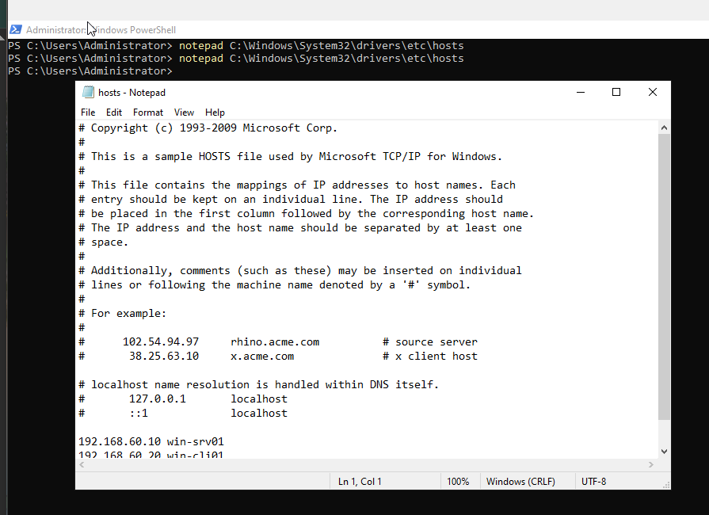

#### 3.Comprobar resolución
- ping win-cli01
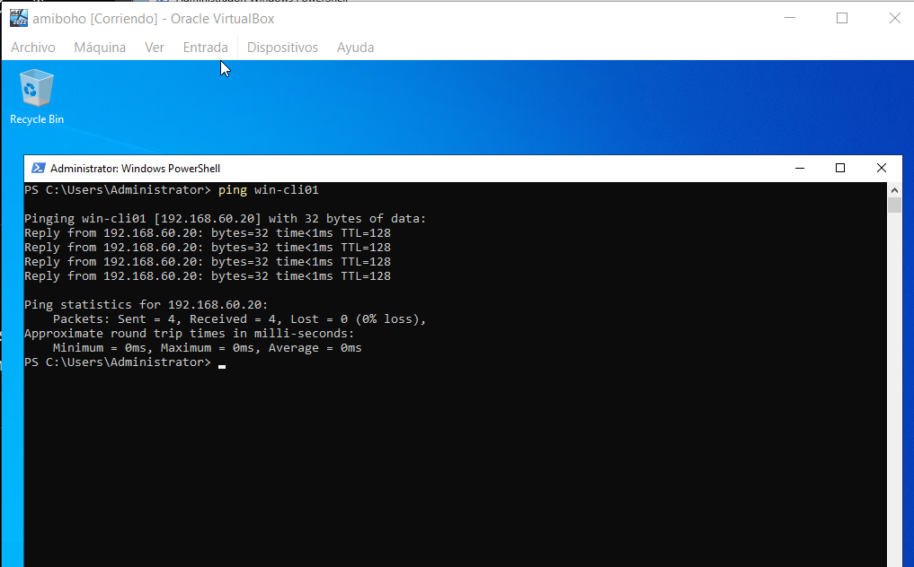

### 8-2.EN WINDOWS 11 (CLIENTE):
#### 1.Abrir el archivo hosts como administrador
- notepad C:\Windows\System32\drivers\etc\hosts
#### 2.Añadir estas líneas:
- 192.168.60.10 win-srv01
- 192.168.60.20 win-cli01

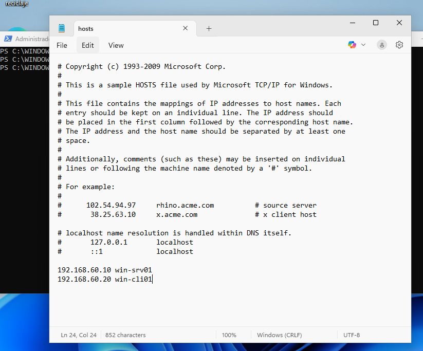

#### 3.Comprobar resolución
- he dejado windows server encendido y todo ha pasado bien.

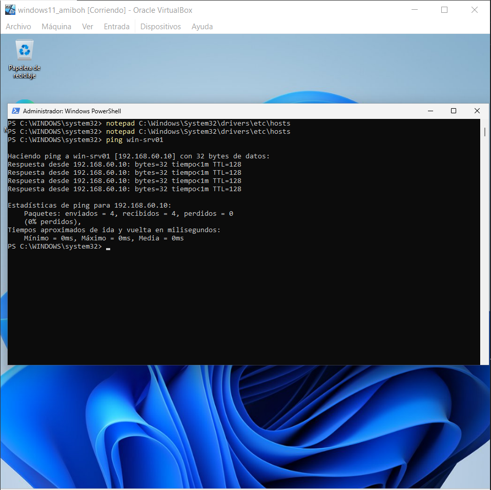

### Explicacion:
- Se configuró el archivo hosts en ambos equipos para permitir la resolución de nombres de forma local. Cada sistema utiliza su propio archivo hosts, por lo que fue necesario realizar la configuración tanto en el servidor como en el cliente.

## 9. Análisis de puertos abiertos
### Comando:
- netstat -ano
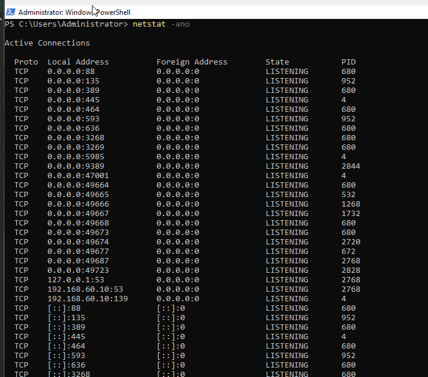

### 1.¿Qué puertos aparecen abiertos?
- Los puertos en estado LISTENING están abiertos 
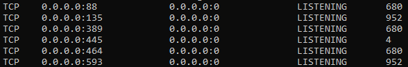

### 2.¿Qué significa cada columna?
- Proto: Tipo de protocolo (TCP o UDP)
- Local Address: IP y puerto del equipo 192.168.60.10:445
- Foreign Address: Dirección remota 0.0.0.0.0 -> cualquier origen
- State: LISTENING → puerto abierto, ESTABLISHED → conexión activa
- PID: Identificador del proceso que usa ese puerto

### 3.¿Qué indica el PID?
- El PID (Process ID) identifica el programa que está usando ese puerto

### Explicacion:
- El comando netstat -ano permite visualizar las conexiones de red activas y los puertos abiertos en el sistema.
Se observan puertos en estado LISTENING, lo que indica que están abiertos y esperando conexiones.
Cada línea muestra el protocolo, la dirección local, la dirección remota, el estado y el identificador de proceso (PID), que permite identificar qué aplicación está utilizando ese puerto.

### Documento consultado:
[Microsoft](https://learn.microsoft.com/en-us/windows-server/administration/windows-commands/netstat)

## 10.Consulta de la tabla ARP
### Comando:
- arp -a
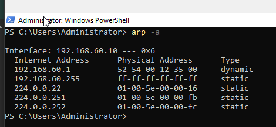

### 1.¿Qué dirección IP aparece asociada al otro equipo?
- 192.168.60.1 -> Esto corresponde a la puerta de enlace (router), no al otro equipo.
- No aparece 192.168.60.20 (cliente) porque:  
-> No está encendido windows 11 porque no puedo abrir las dos al mismo porque mi equipo no puede. 

### 2.¿Qué dirección MAC tiene?
- Para la IP 192.168.60.1:, MAC: 52-54-00-12-35-00

### Explicacion: 
- La tabla ARP relaciona:  
-> Dirección IP → Dirección MAC  
- IP: 192.168.60.1
- MAC: 52-54-00-12-35-00
- Esto permite enviar datos al dispositivo correcto dentro de la red

- El comando arp -a muestra la tabla ARP del sistema, que relaciona direcciones IP con direcciones MAC.
En la salida se observa la dirección IP 192.168.60.1 asociada a la dirección MAC 52-54-00-12-35-00, correspondiente a la puerta de enlace.
No aparece el otro equipo (192.168.60.20), lo que indica que aún no se ha establecido comunicación con él.
La tabla ARP permite al sistema identificar físicamente los dispositivos dentro de la red local.

### Documentacion consultada:
[Microsoft](https://learn.microsoft.com/en-us/windows-server/administration/windows-commands/arp)

## 11. Creación de una carpeta compartida
### 1. Crear la carpeta

- New-Item -Path C:\red -ItemType Directory
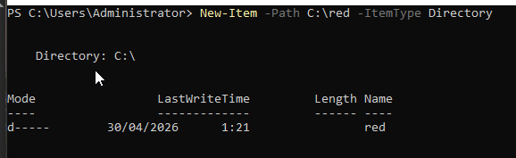  
--> Esto crea la carpeta C:\red

### 2. Compartir la carpeta

- New-SmbShare -Name red -Path C:\red  
--> Esto crea un recurso compartido llamado:  
-win-srv01\red  

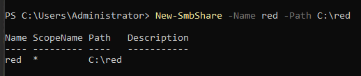

### 3.Comprobar los recursos compartidos

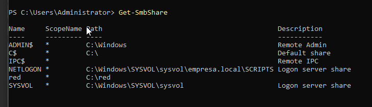

### ¿Cómo funcionan los recursos compartidos?
- Permiten que otros equipos accedan a archivos por red
- Desde el cliente puedes acceder a esa carpeta

### Explicacion:
- Se creó una carpeta en la ruta C:\red y se compartió en la red mediante el comando New-SmbShare.
Esto permite que otros equipos puedan acceder a dicha carpeta a través de la red utilizando el protocolo SMB.
Se comprobó la creación del recurso compartido con el comando Get-SmbShare, observando que la carpeta aparece en la lista de recursos disponibles.

### Documentacion:
[Microsoft](https://learn.microsoft.com/en-us/powershell/module/smbshare/new-smbshare)

## 12.Acceso al recurso compartido

### 1.Conectar al recurso compartido
- net use Z: \\win-srv01\red

- Este hace:   
-> Conecta la carpeta compartida  
-> La asigna como unidad Z:

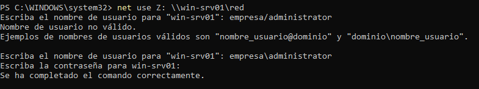

### 2.Comprobar la conexión
- net use

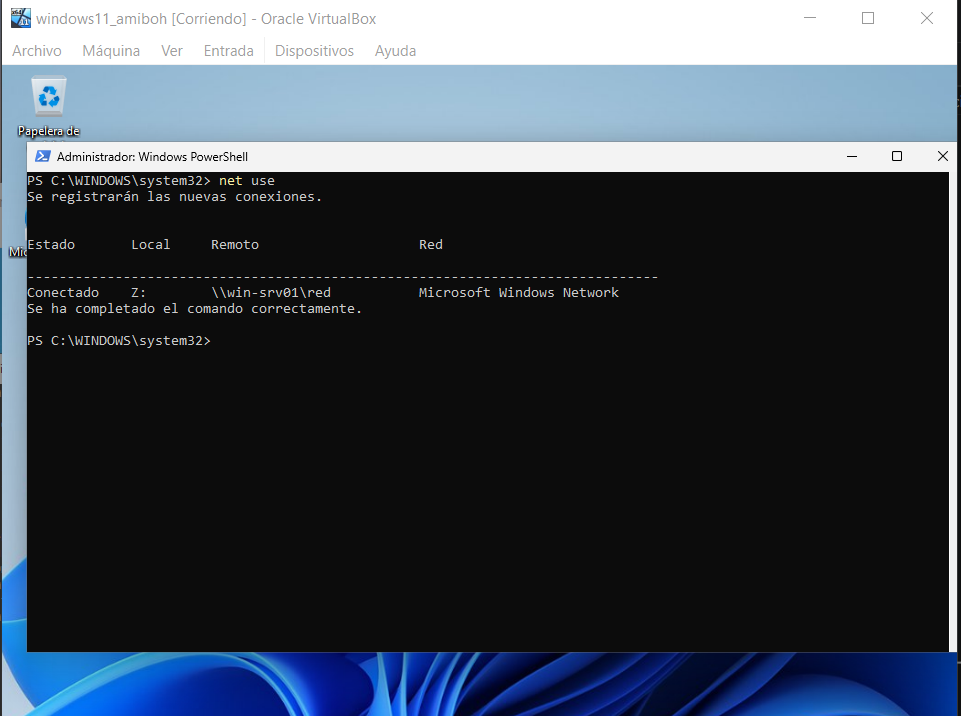

### 3.Ver el contenido
- dir Z:  
-> Muestra los archivos dentro de la carpeta compartida  

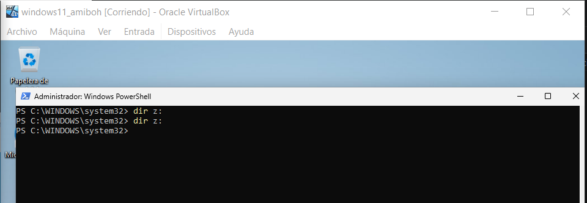

### Explicacion:
- Se utilizó el comando net use para acceder al recurso compartido del servidor, asignándolo a la unidad Z:.
Posteriormente, se verificó la conexión mediante net use, observando que el recurso estaba correctamente montado.
Finalmente, se utilizó el comando dir Z: para comprobar el acceso al contenido de la carpeta compartida.
Este proceso permite acceder a recursos remotos como si fueran unidades locales en el sistema.

### Documentacion consultada: 
[Microsoft](https://learn.microsoft.com/en-us/windows-server/administration/windows-commands/net-use)

## 13.Acceso al recurso compartido:
### EN WINDOWS 11 (CLIENTE)

#### 1.Crear el archivo
- natepad prueba.txt
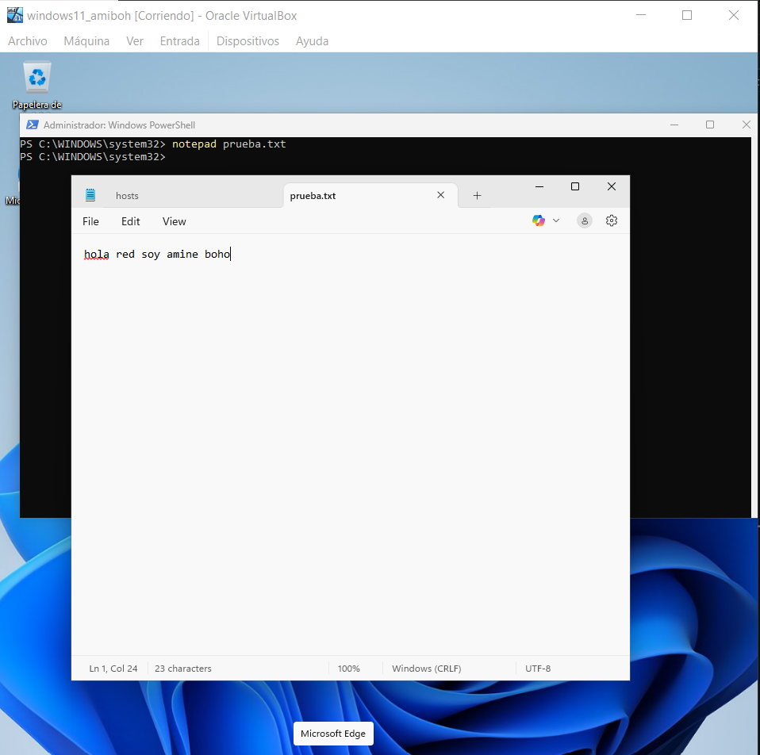

#### 2.Copiar al recurso compartido
- copy prueba.txt z:\
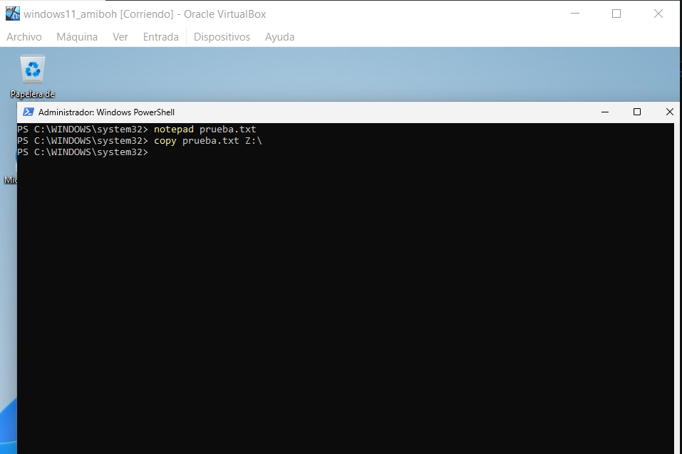

### EN WINDOWS SERVER 2022 (SERVIDOR)
#### 1.Comprobar que llegó el archivo
- dir C:\red
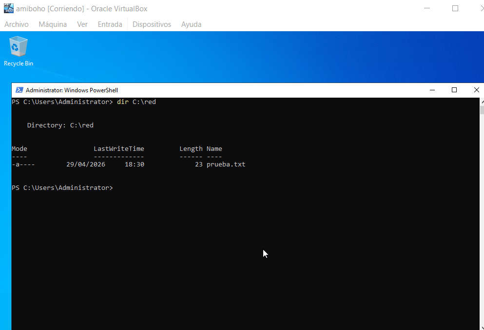

### ¿Qué he hecho?
- He transferido un archivo:
- Desde el cliente
- A través de la red
- Hacia el servidor
- Usando la carpeta compartida (SMB)

### Explicacion:
- Se creó un archivo de texto en el equipo cliente utilizando el comando notepad.
Posteriormente, se copió al recurso compartido mediante el comando copy, utilizando la unidad de red asignada (Z:).
Finalmente, se comprobó desde el servidor que el archivo se había transferido correctamente, verificando su presencia en la carpeta compartida.

### Documentacion consultada:
[Microsoft](https://learn.microsoft.com/en-us/windows-server/administration/windows-commands/copy)

## 14.Análisis de conexiones activas
### Comando
- netstat -ano

### EN WINDOWS SERVER 2022
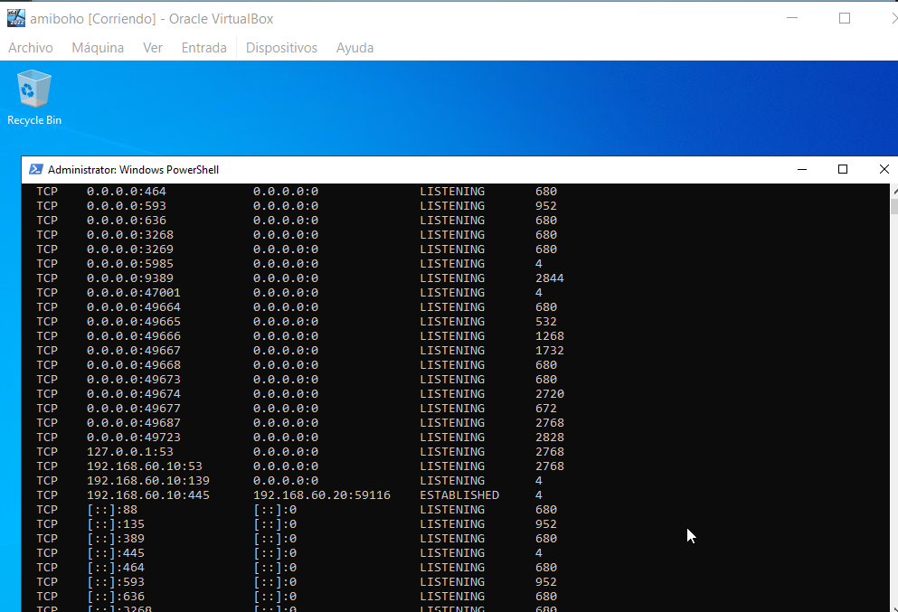

- hay una línea clave:
- 192.168.60.10:445   192.168.60.20:59116   ESTABLISHED

--> Hay una conexión entre:  
-Servidor: 192.168.60.10  
-Cliente: 192.168.60.20  
-Puerto: 445 -> SMB(carpetas compartidas)  
-La conecion esta activa  
-Se están intercambio datos

### EN WINDOWS 11
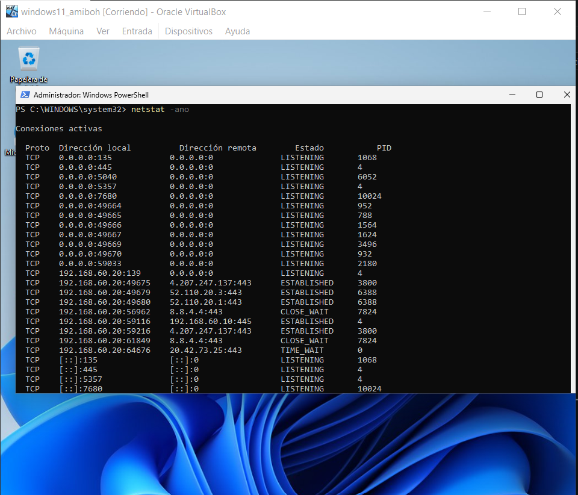

- hay una línea clave:
- 192.168.60.20:59116   192.168.60.10:445   ESTABLISHED

--> Esto significa:
-Cliente → 192.168.60.20
-Servidor → 192.168.60.10
-Puerto → 445 (SMB)
-Estado → ESTABLISHED

### Explicacion:
- El comando netstat -ano permite visualizar las conexiones activas del sistema.
Se observan conexiones en estado ESTABLISHED, lo que indica que están activas y en uso.
También pueden aparecer conexiones en estado LISTENING, que indican que un servicio está esperando conexiones.
Este comando permite analizar el tráfico de red y los procesos asociados mediante el PID.

### Documentacion consltada:
[Microsoft](https://learn.microsoft.com/en-us/windows-server/administration/windows-commands/netstat)

## 15.Comprobación tras reinicio
### 1.Comprobar la dirección IP
#### EN WS22
- ipconfig

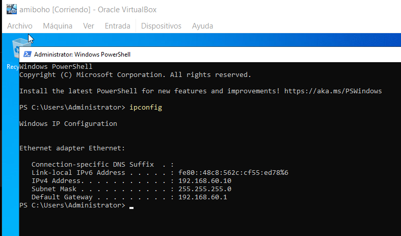

#### EN W11
- ipconfig
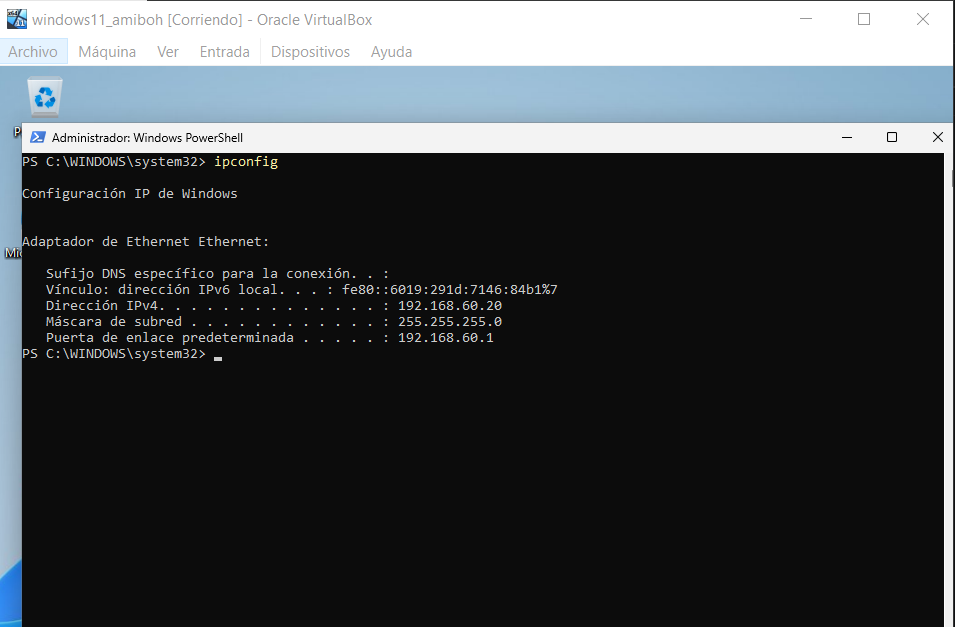

### 2.Comprobar el nombre del equipo
#### EN WS22
- hostname
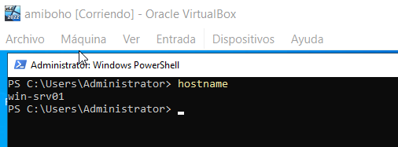

#### EN W11
- hostname
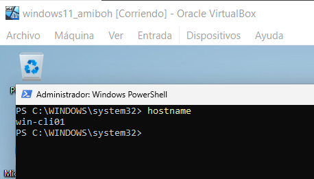

### 3.Comprobar recurso compartido
#### EN WS22
- Get-SmbShare
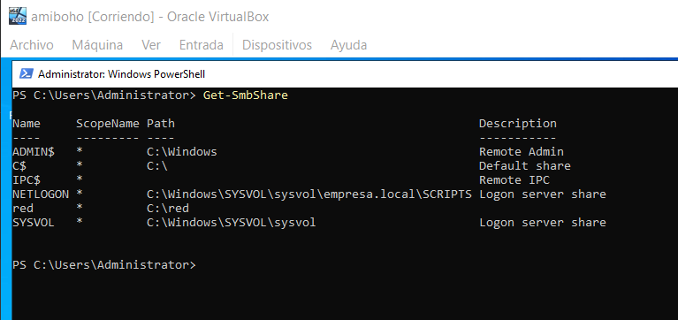

#### EN W11
- net use
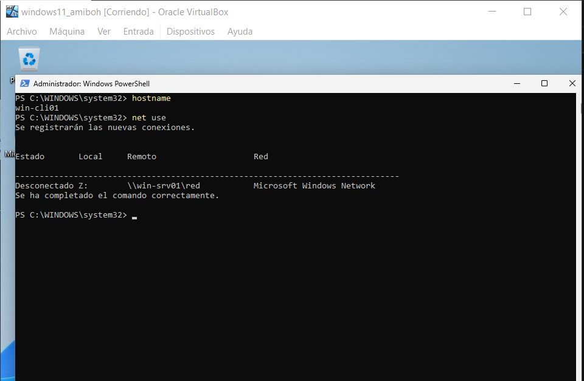

### 4.Comprobar acceso
#### EN W11
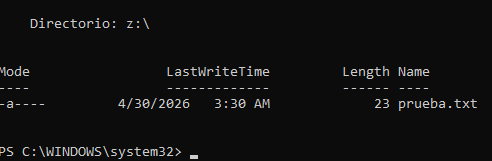

### Expicacion:
- Tras reiniciar ambos equipos, se verificó que la configuración de red se mantiene correctamente.
La dirección IP sigue asignada manualmente, el nombre del equipo permanece sin cambios y el recurso compartido continúa disponible.
Esto demuestra que la configuración es persistente y se guarda en el sistema tras el reinicio.

### Documentacion consultada
[Microsoft](https://learn.microsoft.com/en-us/windows-server/administration/windows-commands/ipconfig)

